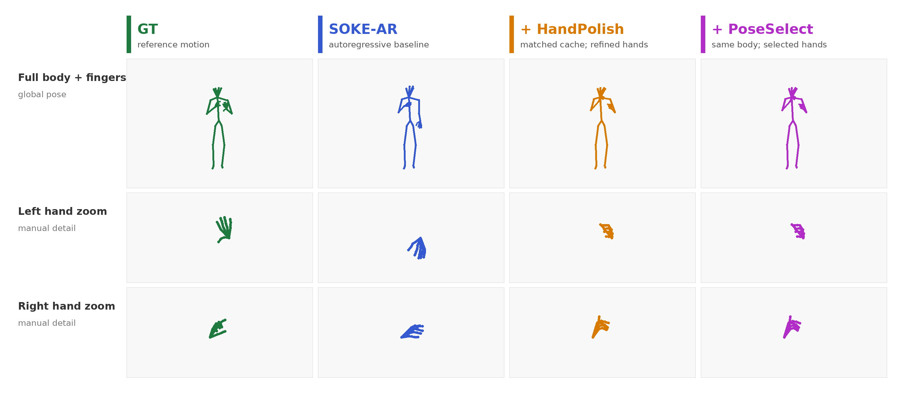

# Efficient Masked Decoding for Sign Motion Generation

Code artifact for the paper:

**Efficient Masked Decoding for Sign Motion Generation with Hand-Aware Token Refinement**

This repository is organized as a scientific reproducibility path. Its purpose
is to let a reviewer reconstruct the codebase, inspect how each paper
contribution is implemented, and run the experiments that support the reported
claims.

## What the Paper Studies

The paper asks whether a SOKE-compatible sign-motion token space can be decoded
more efficiently and then refined locally on uncertain hand tokens without
changing the tokenizer or final VQ decoder.

The code implements and evaluates three paper contributions:

| Contribution | Question | Code to inspect |
|---|---|---|
| **Masked-NAR** | Can SOKE-compatible body/left-hand/right-hand tokens be generated with masked parallel decoding instead of autoregressive decoding? | `mGPT/archs/mgpt_mbart_nar_p3_train_aligned.py` |
| **HandPolish** | Can low-confidence hand tokens be reopened while preserving body tokens by construction? | `mGPT/archs/mgpt_mbart_nar_p5_hand_polish_aggressive.py` |
| **PoseSelect** | Can a learned post-cache selector choose better top-k hand-token candidates using only inference-available features? | `scripts/train_poseselect.py`, `scripts/eval_poseselect.py`, `mGPT/models/utils/p6_topk_candidate_selector.py` |

The artifact also includes:

| Component | Role |
|---|---|
| **SOKE-AR** | upstream-compatible autoregressive baseline |
| **GainEdit** | deployable post-cache baseline for hand-token editing |
| **OracleSelect** | non-deployable diagnostic ceiling using ground-truth supervision |
| **Table 2-5 wrappers** | stable entrypoints for the paper protocols |
| **Qualitative assets** | selected paper qualitative figure and regeneration script |

Historical implementation names such as `p3`, `p5` or `p6` appear in filenames
because they were used during development. The paper-facing names are
**Masked-NAR**, **HandPolish**, **PoseSelect**, **GainEdit** and
**OracleSelect**.


The qualitative comparison used in the paper is also included:



## Repository Shape

This work is built on top of the official SOKE codebase:

| Item | Value |
|---|---|
| Upstream repository | https://github.com/2000ZRL/SOKE |
| Required upstream commit | `5cbc55d84b5a7cbf05a9cf020c468052e8d94d00` |

Because upstream SOKE is distributed under `CC BY-NC-ND 4.0`, this repository
does not publish a full modified SOKE tree. Instead, it provides a patch and an
overlay that reconstruct the complete working code locally.

| Path | Purpose |
|---|---|
| `patches/soke-integration.patch` | modifications to upstream SOKE files |
| `overlay/` | new files added by this paper |
| `scripts/apply_delta.sh` | applies the patch and copies the overlay |
| `docs/EXTERNAL_ARTIFACTS.md` | detailed data, weights and cache setup |

The rest of this README is written from the perspective of the reconstructed
SOKE checkout, because that is the codebase a reviewer will run.

## 1. Reconstruct the Codebase

From an empty directory:

```bash
git clone https://github.com/2000ZRL/SOKE.git
git -C SOKE checkout 5cbc55d84b5a7cbf05a9cf020c468052e8d94d00

git clone https://github.com/francescocassini/efficient-masked-sign-motion-hand-refinement.git
bash efficient-masked-sign-motion-hand-refinement/scripts/apply_delta.sh SOKE

cd SOKE
python tests/test_release_layout.py
```

The final command checks that the reconstructed tree contains the paper code,
configs, wrappers, docs and qualitative assets.

Manual reconstruction is equivalent to:

```bash
git -C SOKE apply ../efficient-masked-sign-motion-hand-refinement/patches/soke-integration.patch
cp -a ../efficient-masked-sign-motion-hand-refinement/overlay/. SOKE/
```

## 2. Create the Environment

Use the upstream SOKE environment as the base:

```bash
conda create python=3.10 --name soke
conda activate soke
pip install -r requirements.txt
python -m pip install huggingface_hub hf-transfer
```

The reconstructed codebase also contains Docker helpers:

```bash
docker compose build
docker compose run --rm sokenar smoke
```

Docker still expects datasets and model artifacts to be placed or mounted in the
paths described below.

## 3. Download External Assets

The repository intentionally excludes datasets, generated caches, checkpoints
and large model weights. This keeps the code artifact legal and inspectable.

After reconstruction:

```bash
cp .env.example .env
```

Then edit `.env` if you use non-default local paths.

### Upstream SOKE Assets

These assets are inherited from SOKE and are required before running full
training/evaluation.

| Asset | Source | Expected path |
|---|---|---|
| How2Sign raw videos | https://how2sign.github.io/ | `datasets/How2Sign/` |
| How2Sign SOKE split files | https://drive.google.com/drive/folders/1sPhBwmiWCXLZSHtM3fpotbz3BDgoYmco?usp=sharing | `datasets/How2Sign/` |
| CSL-Daily raw videos | http://home.ustc.edu.cn/~zhouh156/dataset/csl-daily/ | `datasets/CSL-Daily/` |
| CSL-Daily SOKE split files | https://drive.google.com/drive/folders/17uPm6r5_DQ9CIYZonfwQLpw1XI8LeNEr?usp=drive_link | `datasets/CSL-Daily/` |
| Phoenix-2014T raw videos | https://www-i6.informatik.rwth-aachen.de/~koller/RWTH-PHOENIX-2014-T/ | `datasets/Phoenix_2014T/` |
| Phoenix-2014T SOKE split files | https://drive.google.com/drive/folders/1Z2zjOH5wvwT7x_F6IycWAN-nh2wgJOx1?usp=sharing | `datasets/Phoenix_2014T/` |
| SOKE SMPL-X poses | https://2000zrl.github.io/soke/ | dataset-specific pose folders under `datasets/` |
| Human models | https://drive.google.com/file/d/1YIXddvvBJPQVRuKON2Xc9EEDXikRTteo/view?usp=sharing | `deps/smpl_models/` |
| mBART assets | https://drive.google.com/drive/folders/1GnaHrI0PC4ZRr-GK3FS2GXcQwlrpA5Gi?usp=sharing | `deps/mbart-h2s-csl-phoenix/` |
| CSL mean | https://drive.google.com/file/d/1NH-eVtS0nNjMjCwae-A1ii5sxj44C3bo/view?usp=sharing | `datasets/CSL-Daily/mean.pt` |
| CSL std | https://drive.google.com/file/d/1FHHWS0GPM2s6S2PB2JHv4ufdEbzezuKW/view?usp=sharing | `datasets/CSL-Daily/std.pt` |
| SOKE tokenizer checkpoint | https://drive.google.com/file/d/18HdPeXwz4O6LY4FZMC5BZ9rja4pcUTFk/view?usp=sharing | `deps/tokenizer_ckpt/tokenizer.ckpt` |

### Paper-Specific Artifacts

The paper-specific checkpoints and caches are not upstream SOKE assets. They
must be created by running the experiments below, or downloaded from a public
artifact release if the authors publish one.

| Paper-facing role | Expected path |
|---|---|
| SOKE-AR baseline checkpoint | `artifacts/checkpoints/soke_ar_e69.ckpt` |
| Masked-NAR checkpoint used for HandPolish | `artifacts/checkpoints/masked_nar_e19.ckpt` |
| Masked-NAR direct-generation checkpoint | `artifacts/checkpoints/masked_nar_e49.ckpt` |
| Default Masked-NAR runtime checkpoint | `artifacts/checkpoints/p3.ckpt` |
| P6-B hand-token editor used by PoseSelect features | `artifacts/p6b/p6b.ckpt` |
| GainEdit regressor checkpoint | `artifacts/gainedit/gainedit.ckpt` |
| PoseSelect checkpoint | `artifacts/poseselect/poseselect.ckpt` |
| HandPolish cache replicas | `artifacts/handpolish_cache/rep0/` ... `rep4/` |

The default runtime checkpoint `artifacts/checkpoints/p3.ckpt` is used by the
simple inference configs. It should usually point to the Masked-NAR checkpoint
used for HandPolish:

```bash
ln -s masked_nar_e19.ckpt artifacts/checkpoints/p3.ckpt
```

### Creating Paper-Specific Artifacts

The intended reproducibility path is to create the paper artifacts from data:

| Artifact | Creation path |
|---|---|
| SOKE-AR baseline checkpoint | train/evaluate the upstream-compatible SOKE-AR baseline using the reconstructed SOKE environment |
| Masked-NAR checkpoints | run **Experiment 1** below with `configs/train/p3_csl_phoenix.yaml`; select the checkpoints used by the table configs |
| HandPolish cache replicas | run **Experiment 2** with prediction saving enabled, or `configs/paper/table4_poseselect_postcache.yaml` for matched-cache evaluation |
| P6-B hand-token editor | train the included hand-token editor scripts on saved HandPolish caches |
| GainEdit regressor | train with `scripts/train_gainedit.py` on saved HandPolish caches |
| PoseSelect selector | train with `scripts/train_poseselect.py` on saved HandPolish caches |

If a public model artifact bundle is released, it should use the file names in
the table above so the expected paths remain unchanged. Until such a public
bundle exists, the README treats these files as artifacts to be regenerated.

### Optional Dataset Archive Mirror

If you maintain a local or institutional mirror of prepared datasets, package
them as:

```text
How2Sign.tar.gz
CSL-Daily.tar.gz
Phoenix_2014T.tar.gz
```

Then run:

```bash
bash scripts/download_dataset_from_hf.sh YOUR_DATASET_REPO_OR_MIRROR datasets
```

See `docs/EXTERNAL_ARTIFACTS.md` for the full artifact checklist.

## 4. Source and Artifact Sanity Checks

Run these checks before the scientific experiments.

Source-only checks:

```bash
python tests/test_release_layout.py
python -m py_compile \
  scripts/reproduce_table2_pose.py \
  scripts/reproduce_table3_efficiency.py \
  scripts/reproduce_table4_refinement.py \
  scripts/reproduce_table5_overhead.py \
  scripts/train_poseselect.py \
  scripts/eval_poseselect.py \
  scripts/train_gainedit.py \
  scripts/eval_gainedit.py \
  scripts/eval_oracleselect.py
```

Artifact-aware checks:

```bash
test -f deps/tokenizer_ckpt/tokenizer.ckpt
test -d deps/mbart-h2s-csl-phoenix
test -f artifacts/checkpoints/p3.ckpt
test -f datasets/CSL-Daily/mean.pt
test -f datasets/CSL-Daily/std.pt
```

## 5. Experiment 1: Masked-NAR Generation

**Paper claim checked:** Masked-NAR replaces autoregressive token generation
with iterative masked parallel decoding in the same SOKE-compatible token space.
It estimates token length from text and does not use ground-truth length at test
time.

Main implementation:

| Role | File |
|---|---|
| generator | `mGPT/archs/mgpt_mbart_nar_p3_train_aligned.py` |
| LM config | `configs/lm/mbart_h2s_csl_phoenix_nar_p3_train_aligned.yaml` |
| training config | `configs/train/p3_csl_phoenix.yaml` |
| inference configs | `configs/infer/p3_csl.yaml`, `configs/infer/p3_phoenix.yaml` |

What to inspect:

- length is estimated from text at inference;
- body, left-hand and right-hand prediction heads are stream-specific;
- iterative decoding reopens low-confidence positions using a masked schedule;
- generated tokens are decoded by the unchanged SOKE-compatible VQ decoder.

Train Masked-NAR:

```bash
python -m train --cfg configs/train/p3_csl_phoenix.yaml \
  --nodebug --use_gpus 0 --device 0 --num_nodes 1
```

Run Masked-NAR inference on Phoenix:

```bash
python -m test --cfg configs/infer/p3_phoenix.yaml \
  --task t2m --nodebug --use_gpus 0 --device 0 --num_nodes 1
```

Run the paper Table 2 configuration listing:

```bash
python scripts/reproduce_table2_pose.py
```

Then execute the printed Masked-NAR config with:

```bash
python -u -m test --cfg configs/paper/table2_masked_nar_direct.yaml \
  --task t2m --nodebug
```

Expected paper-level evidence is summarized in `docs/PAPER_RESULTS.md` under
Table 2.

## 6. Experiment 2: HandPolish

**Paper claim checked:** HandPolish reuses Masked-NAR probabilities at inference
to reopen low-confidence hand tokens while keeping body tokens fixed. It adds no
trainable parameters.

Main implementation:

| Role | File |
|---|---|
| hand-only refinement | `mGPT/archs/mgpt_mbart_nar_p5_hand_polish_aggressive.py` |
| LM config | `configs/lm/mbart_h2s_csl_phoenix_nar_p5_hand_polish_aggressive.yaml` |
| inference configs | `configs/infer/p5_csl.yaml`, `configs/infer/p5_phoenix.yaml` |

What to inspect:

- HandPolish has no separate trainable network;
- body tokens are fixed before hand remasking begins;
- only left/right hand positions with low confidence are reopened;
- the refinement remains inside the discrete SOKE-compatible hand codebooks.

Run Masked-NAR + HandPolish inference:

```bash
python -m test --cfg configs/infer/p5_phoenix.yaml \
  --task t2m --nodebug --use_gpus 0 --device 0 --num_nodes 1
```

Run the paper Table 2 HandPolish operating point:

```bash
python -u -m test --cfg configs/paper/table2_handpolish.yaml \
  --task t2m --nodebug
```

Reviewer check: inspect the code path to verify that the body stream is copied
unchanged and only left/right hand tokens are reopened.

## 7. Experiment 3: End-to-End Efficiency

**Paper claim checked:** Masked-NAR reduces end-to-end test-loop time relative
to SOKE-AR, and HandPolish adds only a small measured overhead.

Entrypoint:

```bash
python scripts/reproduce_table3_efficiency.py
```

This wrapper lists the benchmark scripts used for Table 3:

| Dataset | Script/config family |
|---|---|
| Phoenix-200 | `scripts/t0a_efficiency_benchmark.py`, `configs/paper/table3_*_phoenix200.yaml` |
| CSL-200 | `scripts/t0a_efficiency_benchmark_csl.py`, `configs/paper/table3_*_csl200.yaml` |

The protocol includes generation, VQ decoding, exact-DTW metrics and prediction
saving. GPU-board energy numbers require the same hardware-monitoring setup
used in the paper.

Expected paper-level evidence is summarized in `docs/PAPER_RESULTS.md` under
Table 3.

## 8. Experiment 4: PoseSelect Post-Cache Refinement

**Paper claim checked:** PoseSelect is a learned post-cache selector over top-k
hand-token candidates. It is trained with offline oracle labels, but at
inference uses only generated-cache and candidate-token features.

Main implementation:

| Role | File |
|---|---|
| training wrapper | `scripts/train_poseselect.py` |
| evaluation wrapper | `scripts/eval_poseselect.py` |
| selector model | `mGPT/models/utils/p6_topk_candidate_selector.py` |
| Table 4 aggregation | `scripts/reproduce_table4_refinement.py` |

What to inspect:

- candidate sets are formed from generated hand-token alternatives;
- training labels are computed offline, but inference features do not require
  ground-truth poses;
- the selector chooses among candidates instead of regressing arbitrary
  continuous hand poses;
- body features/tokens are copied from the HandPolish cache.

Train PoseSelect from saved HandPolish caches:

```bash
python scripts/train_poseselect.py \
  --cache-dir artifacts/handpolish_cache/train \
  --val-cache-dir artifacts/handpolish_cache/val \
  --p6b-checkpoint artifacts/p6b/p6b.ckpt \
  --regressor-checkpoint artifacts/gainedit/gainedit.ckpt \
  --output-dir artifacts/poseselect
```

Evaluate PoseSelect:

```bash
python scripts/eval_poseselect.py \
  --dataset both \
  --cache-dir artifacts/handpolish_cache/test \
  --p6b-checkpoint artifacts/p6b/p6b.ckpt \
  --regressor-checkpoint artifacts/gainedit/gainedit.ckpt \
  --selector-checkpoint artifacts/poseselect/poseselect.ckpt \
  --output-dir results/poseselect_eval \
  --mean-path datasets/CSL-Daily/mean.pt \
  --std-path datasets/CSL-Daily/std.pt
```

Aggregate the paper Table 4 matched-cache protocol:

```bash
python scripts/reproduce_table4_refinement.py
```

Reviewer checks:

- PoseSelect is not parameter-free.
- OracleSelect is a diagnostic ceiling and should not be treated as deployable.
- PoseSelect copies the body stream from the HandPolish cache and edits only
  selected hand tokens.

Expected paper-level evidence is summarized in `docs/PAPER_RESULTS.md` under
Table 4.

## 9. Experiment 5: Post-Cache Overhead

**Paper claim checked:** PoseSelect and GainEdit are measured as post-cache
refinement stages, separate from native generation.

Run:

```bash
python scripts/reproduce_table5_overhead.py --help
```

The underlying benchmark is `scripts/benchmark_p6k_t0a_style.py`. It starts
from a validated HandPolish cache and measures deployable post-cache variants.

Expected paper-level evidence is summarized in `docs/PAPER_RESULTS.md` under
Table 5.

## 10. Qualitative Figure

The selected qualitative asset is included for paper inspection:

```text
assets/figures/figure_2.png
assets/figures/paper_qualitative_contrastive_compact_2x.png
```

Regeneration wrapper:

```bash
python scripts/make_paper_qualitative_figure.py
```

The figure is qualitative evidence only. Quantitative claims should be checked
through the table protocols above.

## Paper Results Index

Recorded paper table values are in:

```text
docs/PAPER_RESULTS.md
docs/results/table4_poseselect/summary.md
docs/results/table4_poseselect/summary.json
docs/results/table5_overhead/summary.json
```

## Reviewer Checklist

Use this checklist to verify that the code matches the paper narrative:

- Masked-NAR uses estimated length at test time, not ground-truth length.
- Masked-NAR predicts body, left-hand and right-hand tokens with stream-specific
  valid codebooks.
- HandPolish reopens only low-confidence hand tokens and keeps body tokens
  fixed.
- PoseSelect is learned, post-cache and ground-truth-free at inference.
- GainEdit is a deployable baseline; OracleSelect is non-deployable diagnostic
  ceiling.
- Table 2/3 are native generation protocols; Table 4/5 are post-cache protocols.
- Reported energy is GPU-board/protocol-specific, not a universal system energy
  claim.

## Limitations

- The complete code is reconstructed locally from SOKE plus this paper overlay.
- Datasets, checkpoints and generated caches are intentionally not committed.
- Exact paper numbers require the documented external artifacts, cache replicas
  and hardware protocol.
- The reconstructed SOKE+paper checkout should not be redistributed as a full
  modified SOKE fork without a separate license/provenance decision.

## Citation

If this artifact is useful, cite this paper and upstream SOKE:

```bibtex
@inproceedings{zuo2025soke,
  title={Signs as Tokens: A Retrieval-Enhanced Multilingual Sign Language Generator},
  author={Zuo, Ronglai and Potamias, Rolandos Alexandros and Ververas, Evangelos and Deng, Jiankang and Zafeiriou, Stefanos},
  booktitle={ICCV},
  year={2025}
}
```
