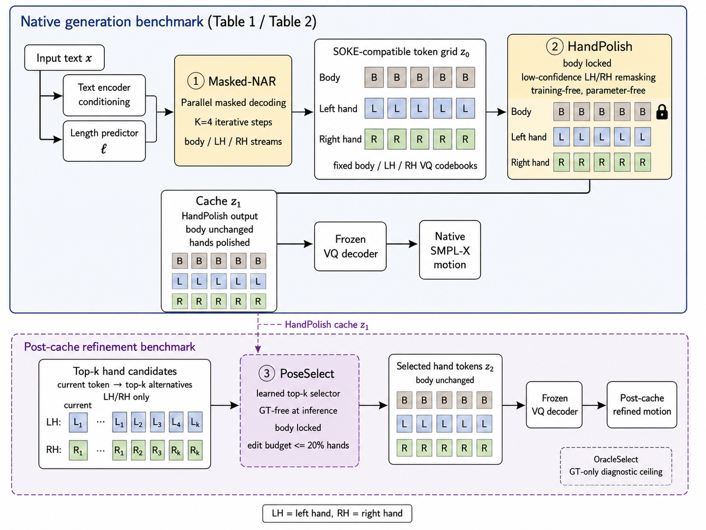

# Efficient Masked Decoding for Sign Motion Generation with Hand-Aware Token Refinement

Text-to-sign motion generation maps written sentences to articulated signing
sequences. Token-based generators such as SOKE encode motion as separate body,
left hand and right hand Vector Quantized (VQ) streams and generate them
autoregressively from text, so decoding cost grows with sequence length. This
work keeps the tokenizer, the anatomical streams and the VQ decoder fixed and
replaces sequential decoding with a three-stage hand-aware pipeline:

- **Masked-NAR** generates the three token streams in parallel through
  iterative masked non-autoregressive decoding, with the token length
  estimated from the text;
- **HandPolish** reopens and regenerates low-confidence hand tokens at
  inference time while the body stream remains fixed, without training an
  additional refinement network;
- **PoseSelect** selects among top-k alternative hand tokens with a learned
  selector that uses only pose features available at inference time.

On CSL-Daily and Phoenix-2014T, Masked-NAR improves three of the four direct
pose metrics over the autoregressive baseline, with end-to-end speedups
between 1.73x and 2.02x and about a quarter of the measured GPU energy.
HandPolish and PoseSelect further improve hand articulation at a measured
extra cost.

This repository contains the code needed to reproduce the experiments of the
paper.



## Code Map

| Stage | Main code |
|---|---|
| **Masked-NAR** | `mGPT/archs/mgpt_mbart_nar_p3_train_aligned.py` |
| **HandPolish** | `mGPT/archs/mgpt_mbart_nar_p5_hand_polish_aggressive.py` |
| **PoseSelect** | `scripts/train_poseselect.py`, `scripts/eval_poseselect.py`, `mGPT/models/utils/p6_topk_candidate_selector.py` |

The evaluation also includes **SOKE-AR** (the autoregressive baseline),
**GainEdit** (a deployable post-cache hand-token editing baseline),
**OracleSelect** (a diagnostic ceiling that uses ground-truth supervision) and
the wrapper scripts for the paper tables (`scripts/reproduce_table*.py`).

## Repository Shape

This work is built on top of the official SOKE codebase:

| Item | Value |
|---|---|
| Upstream repository | https://github.com/2000ZRL/SOKE |
| Required upstream commit | `5cbc55d84b5a7cbf05a9cf020c468052e8d94d00` |

Because upstream SOKE is distributed under `CC BY-NC-ND 4.0`, this repository
does not publish a full modified SOKE tree. Instead, it provides a patch and an
overlay that reconstruct the complete working code locally.

| Path | Purpose |
|---|---|
| `patches/soke-integration.patch` | modifications to upstream SOKE files |
| `overlay/` | new files added by this paper |
| `scripts/apply_delta.sh` | applies the patch and copies the overlay |
| `docs/EXTERNAL_ARTIFACTS.md` | detailed data, weights and cache setup |

All paths and commands below refer to the reconstructed SOKE checkout.

## 1. Reconstruct the Codebase

From an empty directory:

```bash
git clone https://github.com/2000ZRL/SOKE.git
git -C SOKE checkout 5cbc55d84b5a7cbf05a9cf020c468052e8d94d00

git clone <THIS_REPOSITORY_URL> paper-delta
bash paper-delta/scripts/apply_delta.sh SOKE

cd SOKE
python tests/test_release_layout.py
```

The final command checks that the reconstructed tree contains the paper code,
configs and wrappers.

Manual reconstruction is equivalent to:

```bash
git -C SOKE apply ../paper-delta/patches/soke-integration.patch
cp -a ../paper-delta/overlay/. SOKE/
```

## 2. Create the Environment

Use the upstream SOKE environment as the base:

```bash
conda create python=3.10 --name soke
conda activate soke
pip install -r requirements.txt
python -m pip install huggingface_hub hf-transfer
```

The reconstructed codebase also contains Docker helpers:

```bash
docker compose build
docker compose run --rm sokenar smoke
```

Docker still expects datasets and model artifacts to be placed or mounted in the
paths described below.

## 3. Download External Assets

Datasets, generated caches, checkpoints and large model weights are not
committed to this repository.

After reconstruction:

```bash
cp .env.example .env
```

Then edit `.env` if you use non-default local paths.

### Upstream SOKE Assets

These assets are inherited from SOKE and are required before running full
training/evaluation.

| Asset | Source | Expected path |
|---|---|---|
| How2Sign raw videos | https://how2sign.github.io/ | `datasets/How2Sign/` |
| How2Sign SOKE split files | https://drive.google.com/drive/folders/1sPhBwmiWCXLZSHtM3fpotbz3BDgoYmco?usp=sharing | `datasets/How2Sign/` |
| CSL-Daily raw videos | http://home.ustc.edu.cn/~zhouh156/dataset/csl-daily/ | `datasets/CSL-Daily/` |
| CSL-Daily SOKE split files | https://drive.google.com/drive/folders/17uPm6r5_DQ9CIYZonfwQLpw1XI8LeNEr?usp=drive_link | `datasets/CSL-Daily/` |
| Phoenix-2014T raw videos | https://www-i6.informatik.rwth-aachen.de/~koller/RWTH-PHOENIX-2014-T/ | `datasets/Phoenix_2014T/` |
| Phoenix-2014T SOKE split files | https://drive.google.com/drive/folders/1Z2zjOH5wvwT7x_F6IycWAN-nh2wgJOx1?usp=sharing | `datasets/Phoenix_2014T/` |
| SOKE SMPL-X poses | https://2000zrl.github.io/soke/ | dataset-specific pose folders under `datasets/` |
| Human models | https://drive.google.com/file/d/1YIXddvvBJPQVRuKON2Xc9EEDXikRTteo/view?usp=sharing | `deps/smpl_models/` |
| mBART assets | https://drive.google.com/drive/folders/1GnaHrI0PC4ZRr-GK3FS2GXcQwlrpA5Gi?usp=sharing | `deps/mbart-h2s-csl-phoenix/` |
| CSL mean | https://drive.google.com/file/d/1NH-eVtS0nNjMjCwae-A1ii5sxj44C3bo/view?usp=sharing | `datasets/CSL-Daily/mean.pt` |
| CSL std | https://drive.google.com/file/d/1FHHWS0GPM2s6S2PB2JHv4ufdEbzezuKW/view?usp=sharing | `datasets/CSL-Daily/std.pt` |
| SOKE tokenizer checkpoint | https://drive.google.com/file/d/18HdPeXwz4O6LY4FZMC5BZ9rja4pcUTFk/view?usp=sharing | `deps/tokenizer_ckpt/tokenizer.ckpt` |

### Paper-Specific Artifacts

The paper-specific checkpoints and caches are not upstream SOKE assets. They
must be created by running the experiments below, or downloaded from a public
artifact release if one is published.

| Paper-facing role | Expected path |
|---|---|
| SOKE-AR baseline checkpoint | `artifacts/checkpoints/soke_ar_e69.ckpt` |
| Masked-NAR checkpoint used for HandPolish | `artifacts/checkpoints/masked_nar_e19.ckpt` |
| Masked-NAR direct-generation checkpoint | `artifacts/checkpoints/masked_nar_e49.ckpt` |
| Default Masked-NAR runtime checkpoint | `artifacts/checkpoints/p3.ckpt` |
| Hand-token editor used by PoseSelect features | `artifacts/p6b/p6b.ckpt` |
| GainEdit regressor checkpoint | `artifacts/gainedit/gainedit.ckpt` |
| PoseSelect checkpoint | `artifacts/poseselect/poseselect.ckpt` |
| HandPolish cache replicas | `artifacts/handpolish_cache/rep0/` ... `rep4/` |

The default runtime checkpoint `artifacts/checkpoints/p3.ckpt` is used by the
simple inference configs. It should usually point to the Masked-NAR checkpoint
used for HandPolish:

```bash
ln -s masked_nar_e19.ckpt artifacts/checkpoints/p3.ckpt
```

### Creating Paper-Specific Artifacts

The intended reproducibility path is to create the paper artifacts from data:

| Artifact | Creation path |
|---|---|
| SOKE-AR baseline checkpoint | train/evaluate the upstream-compatible SOKE-AR baseline using the reconstructed SOKE environment |
| Masked-NAR checkpoints | run **Experiment 1** below with `configs/train/p3_csl_phoenix.yaml`; select the checkpoints used by the table configs |
| HandPolish cache replicas | run **Experiment 2** with prediction saving enabled, or `configs/paper/table4_poseselect_postcache.yaml` for matched-cache evaluation |
| Hand-token editor | train the included hand-token editor scripts on saved HandPolish caches |
| GainEdit regressor | train with `scripts/train_gainedit.py` on saved HandPolish caches |
| PoseSelect selector | train with `scripts/train_poseselect.py` on saved HandPolish caches |

If a public model artifact bundle is released, it should use the file names in
the table above so the expected paths remain unchanged.

### Optional Dataset Archive Mirror

If you maintain a local or institutional mirror of prepared datasets, package
them as:

```text
How2Sign.tar.gz
CSL-Daily.tar.gz
Phoenix_2014T.tar.gz
```

Then run:

```bash
bash scripts/download_dataset_from_hf.sh YOUR_DATASET_REPO_OR_MIRROR datasets
```

See `docs/EXTERNAL_ARTIFACTS.md` for the full artifact checklist.

## 4. Source and Artifact Sanity Checks

Run these checks before the scientific experiments.

Source-only checks:

```bash
python tests/test_release_layout.py
python -m py_compile \
  scripts/reproduce_table2_pose.py \
  scripts/reproduce_table3_efficiency.py \
  scripts/reproduce_table4_refinement.py \
  scripts/reproduce_table5_overhead.py \
  scripts/train_poseselect.py \
  scripts/eval_poseselect.py \
  scripts/train_gainedit.py \
  scripts/eval_gainedit.py \
  scripts/eval_oracleselect.py
```

Artifact-aware checks:

```bash
test -f deps/tokenizer_ckpt/tokenizer.ckpt
test -d deps/mbart-h2s-csl-phoenix
test -f artifacts/checkpoints/p3.ckpt
test -f datasets/CSL-Daily/mean.pt
test -f datasets/CSL-Daily/std.pt
```

## Experiments

The five experiments below reproduce the paper tables. Each experiment lists
the protocol, the commands and the expected results as reported in the paper.
Recorded reference values are also in `docs/PAPER_RESULTS.md`. Exact
reproduction of the numbers requires the documented checkpoints, caches and
hardware protocol; on different hardware the internal comparisons, not the
absolute values, are the reproducible quantity.

Metrics used throughout:

- **PA-body / PA-hand**: Procrustes-Aligned Joint Position Error computed
  after Dynamic Time Warping temporal alignment (DTW-PA-JPE), reported
  separately for the body stream and for the two hands. Lower is better.
- **Speed/GT and tstd/GT**: ratios between the motion speed (mean displacement
  of consecutive pose frames) and the temporal standard deviation of the
  generated sequence and those of the ground truth (GT) sequence. Values
  closer to one indicate dynamics closer to the reference; they expose the
  oversmoothing that PA-JPE alone would not reveal.
- **Efficiency**: total runtime over 200 samples, throughput, speedup relative
  to SOKE-AR and GPU energy per sample, estimated by sampling the board power
  with `nvidia-smi` during the test loop and integrating over time.

Protocol behind each experiment:

| Experiment | Paper table | Setting | Samples, replicas | Compared methods | GT used |
|---|---|---|---|---|---|
| 1 | Table 2 | native generation | 1818, 5 | SOKE-AR, Masked-NAR | no |
| 2 | Table 2 | native generation | 1818, 5 | Masked-NAR base, + HandPolish | no |
| 3 | Table 3 | end-to-end test loop | 200 per dataset, 3 | SOKE-AR, Masked-NAR, + HandPolish | no |
| 4 | Table 4 | post-cache refinement | 1818, 5 aligned | HandPolish cache, GainEdit, PoseSelect, OracleSelect | OracleSelect only |
| 5 | Table 5 | post-cache runtime | 240 (16 warmup) | GainEdit, PoseSelect | no |

The full test benchmark contains 1818 effective samples (1176 from CSL-Daily,
642 from Phoenix-2014T) after removal of samples without a valid text and
motion pair. All methods produce the three token streams and are evaluated
only after the shared VQ decoder maps them back to a pose sequence; dataset
construction, exact DTW alignment, VQ decoding and the PA-JPE implementation
are shared across all methods.

## 5. Experiment 1: Masked-NAR Generation

Masked-NAR replaces autoregressive token generation with iterative masked
parallel decoding in the same SOKE-compatible token space. Training corrupts
tokens BERT-style (masked, randomly replaced by a valid stream token, or kept
unchanged) with stream-restricted cross-entropy. At inference, token length is
estimated from text (ground-truth length is never used), all positions start
as `[MASK]` and are refined for K=4 iterations: after each iteration,
confidence is averaged across the body, left-hand and right-hand streams and
a cosine schedule reopens the least confident temporal positions. Prediction
heads are stream-specific, so each stream stays inside its own codebook, and
the generated tokens are decoded by the unchanged VQ decoder.

The benchmark uses five independent evaluation replicas with batch size 4.
Two Masked-NAR checkpoints play different roles: *direct* is the strongest
direct comparison against SOKE-AR; *HandPolish base* is the checkpoint to
which HandPolish is applied in Experiment 2.

| Role | File |
|---|---|
| generator | `mGPT/archs/mgpt_mbart_nar_p3_train_aligned.py` |
| LM config | `configs/lm/mbart_h2s_csl_phoenix_nar_p3_train_aligned.yaml` |
| training config | `configs/train/p3_csl_phoenix.yaml` |
| inference configs | `configs/infer/p3_csl.yaml`, `configs/infer/p3_phoenix.yaml` |

Train Masked-NAR:

```bash
python -m train --cfg configs/train/p3_csl_phoenix.yaml \
  --nodebug --use_gpus 0 --device 0 --num_nodes 1
```

Run Masked-NAR inference on Phoenix:

```bash
python -m test --cfg configs/infer/p3_phoenix.yaml \
  --task t2m --nodebug --use_gpus 0 --device 0 --num_nodes 1
```

List the paper Table 2 configurations:

```bash
python scripts/reproduce_table2_pose.py
```

Then execute the printed Masked-NAR config with:

```bash
python -u -m test --cfg configs/paper/table2_masked_nar_direct.yaml \
  --task t2m --nodebug
```

**Expected results** (paper Table 2, DTW-PA-JPE, lower is better, mean over
five replicas with 95% confidence intervals):

| Method | CSL body | CSL hand | PHX body | PHX hand |
|---|---|---|---|---|
| SOKE-AR | 9.6791 | **1.8732** | 8.0912 | 1.6491 |
| Masked-NAR (direct) | 9.1851 ± 0.0502 | 1.8869 ± 0.0056 | 6.9940 ± 0.0429 | 1.4045 ± 0.0047 |

SOKE-AR decodes deterministically from a single pre-trained checkpoint, so
repeated replicas produce identical values. Masked-NAR (direct) improves three
of the four pose metrics; the exception is CSL PA-hand, where SOKE-AR remains
slightly better.

## 6. Experiment 2: HandPolish

HandPolish reuses the Masked-NAR probabilities at inference to reopen
low-confidence hand tokens while keeping body tokens fixed. It adds no
trainable parameters: the body stream is frozen before hand remasking begins
and remains invariant across all passes. Hand-token confidence is the maximum
probability assigned by the generator head under the current grid; three
polishing passes with a decreasing schedule (25%, 15%, 8% of positions per
hand) reopen the least confident left/right hand positions independently and
update them by stream-wise argmax, keeping the sequence length fixed and the
edits inside the discrete SOKE-compatible hand codebooks.

| Role | File |
|---|---|
| hand-only refinement | `mGPT/archs/mgpt_mbart_nar_p5_hand_polish_aggressive.py` |
| LM config | `configs/lm/mbart_h2s_csl_phoenix_nar_p5_hand_polish_aggressive.yaml` |
| inference configs | `configs/infer/p5_csl.yaml`, `configs/infer/p5_phoenix.yaml` |

Run Masked-NAR + HandPolish inference:

```bash
python -m test --cfg configs/infer/p5_phoenix.yaml \
  --task t2m --nodebug --use_gpus 0 --device 0 --num_nodes 1
```

Run the paper Table 2 HandPolish operating point:

```bash
python -u -m test --cfg configs/paper/table2_handpolish.yaml \
  --task t2m --nodebug
```

**Expected results** (paper Table 2, HandPolish applied to its matched base
checkpoint):

| Method | CSL body | CSL hand | PHX body | PHX hand |
|---|---|---|---|---|
| Masked-NAR (HandPolish base) | 8.7414 ± 0.0226 | 1.9343 ± 0.0019 | 6.8017 ± 0.0307 | 1.4031 ± 0.0013 |
| Masked-NAR + HandPolish | **8.7329 ± 0.0223** | **1.8867 ± 0.0013** | **6.7983 ± 0.0306** | **1.3555 ± 0.0037** |

Polishing improves all four metrics on the matched checkpoint, with the main
effect on hand articulation: PA-hand improves by about 2.46% on CSL-Daily and
3.39% on Phoenix-2014T. Body metrics change only slightly and indirectly,
because DTW computes a single temporal alignment for the whole sequence.

## 7. Experiment 3: End-to-End Efficiency

The efficiency benchmark measures the complete test loop (generation, VQ
decoding, exact-DTW metrics and prediction saving) for SOKE-AR, Masked-NAR and
Masked-NAR + HandPolish on Phoenix-200 and CSL-200 (the first 200 samples of
each dataset). The protocol runs on a single NVIDIA RTX 4090 GPU with three
replicas per method; GPU energy is estimated by sampling the board power with
`nvidia-smi` during the loop and integrating over time.

Entrypoint:

```bash
python scripts/reproduce_table3_efficiency.py
```

This wrapper lists the benchmark scripts used for Table 3:

| Dataset | Script/config family |
|---|---|
| Phoenix-200 | `scripts/t0a_efficiency_benchmark.py`, `configs/paper/table3_*_phoenix200.yaml` |
| CSL-200 | `scripts/t0a_efficiency_benchmark_csl.py`, `configs/paper/table3_*_csl200.yaml` |

GPU energy numbers require the same hardware-monitoring setup used in the
paper.

**Expected results** (paper Table 3, measured on one NVIDIA RTX 4090; absolute
values are hardware-dependent, the speedup and energy ratios are the
reproducible comparison):

| Dataset | Method | Time (200) | Sample/s | Speedup | J/sample | Energy ratio |
|---|---|---|---|---|---|---|
| Phoenix | SOKE-AR | 71.62 s | 2.793 | 1.000x | 77.74 | 1.000 |
| Phoenix | Masked-NAR | 34.93 s | 5.727 | 2.051x | 18.37 | 0.236 |
| Phoenix | Masked-NAR + HandPolish | 35.41 s | 5.648 | 2.023x | 19.73 | 0.254 |
| CSL | SOKE-AR | 63.12 s | 3.169 | 1.000x | 72.12 | 1.000 |
| CSL | Masked-NAR | 36.15 s | 5.533 | 1.746x | 18.89 | 0.262 |
| CSL | Masked-NAR + HandPolish | 36.49 s | 5.480 | 1.730x | 19.92 | 0.276 |

HandPolish preserves nearly all of the Masked-NAR efficiency advantage: it
adds 0.48 s on Phoenix-200 and 0.34 s on CSL-200 over the full loop.

## 8. Experiment 4: PoseSelect Post-Cache Refinement

PoseSelect is a learned selector over top-k hand-token candidates built from
saved HandPolish caches. For each hand position, the candidate set contains
the current token plus the top-5 replacement proposals of a dedicated
candidate network; the selector scores candidates using only features
computable from the cache and the candidate tokens (token identity and rank,
confidences, gain-style scores, position and change flags, decoded geometry
and vitality descriptors). An edit budget caps the changed manual positions at
20%, and the body stream is copied unchanged from the cache. Training labels
are computed offline by an oracle that ranks candidates against the
ground-truth pose; at inference no ground truth is used.

PoseSelect is evaluated in two settings: a clean split with disjoint training,
validation and test caches (25491, 1596 and 1818 samples; the selector
checkpoint is chosen on the validation cache), and the R5 setting that applies
PoseSelect to five regenerated HandPolish caches aligned with the main
protocol. Paper Table 4 uses the R5 setting.

| Role | File |
|---|---|
| training wrapper | `scripts/train_poseselect.py` |
| evaluation wrapper | `scripts/eval_poseselect.py` |
| selector model | `mGPT/models/utils/p6_topk_candidate_selector.py` |
| Table 4 aggregation | `scripts/reproduce_table4_refinement.py` |

Train PoseSelect from saved HandPolish caches:

```bash
python scripts/train_poseselect.py \
  --cache-dir artifacts/handpolish_cache/train \
  --val-cache-dir artifacts/handpolish_cache/val \
  --p6b-checkpoint artifacts/p6b/p6b.ckpt \
  --regressor-checkpoint artifacts/gainedit/gainedit.ckpt \
  --output-dir artifacts/poseselect
```

Evaluate PoseSelect:

```bash
python scripts/eval_poseselect.py \
  --dataset both \
  --cache-dir artifacts/handpolish_cache/test \
  --p6b-checkpoint artifacts/p6b/p6b.ckpt \
  --regressor-checkpoint artifacts/gainedit/gainedit.ckpt \
  --selector-checkpoint artifacts/poseselect/poseselect.ckpt \
  --output-dir results/poseselect_eval \
  --mean-path datasets/CSL-Daily/mean.pt \
  --std-path datasets/CSL-Daily/std.pt
```

Aggregate the paper Table 4 matched-cache protocol:

```bash
python scripts/reproduce_table4_refinement.py
```

**Expected results** (paper Table 4, five aligned replicas; all methods start
from the same matched HandPolish caches, so these values are not numerically
comparable with the native HandPolish row of Table 2):

| Dataset | Method | PA-body | PA-hand | Speed/GT | Tstd/GT |
|---|---|---|---|---|---|
| CSL | HandPolish cache | 8.3125 | 1.8072 | 0.772 | 0.611 |
| CSL | + GainEdit | 8.2962 | 1.6908 | 0.734 | 0.586 |
| CSL | + PoseSelect | **8.2931** | **1.6854** | **0.767** | **0.634** |
| CSL | + OracleSelect | 8.2966 | 1.5802 | 0.751 | 0.613 |
| Phoenix | HandPolish cache | 6.7732 | 1.3519 | 0.546 | 0.588 |
| Phoenix | + GainEdit | 6.7662 | **1.3127** | 0.455 | 0.509 |
| Phoenix | + PoseSelect | **6.7631** | 1.3127 | **0.522** | **0.578** |
| Phoenix | + OracleSelect | 6.7650 | 1.2498 | 0.513 | 0.559 |

PoseSelect improves PA-hand over the cache by about 6.74% on CSL-Daily and
2.90% on Phoenix-2014T while preserving more motion vitality than GainEdit
(on CSL it is the only deployable editing variant whose tstd/GT is above the
unedited cache). OracleSelect uses ground truth at evaluation time and is a
diagnostic ceiling, not a deployable method; bold marks the best deployable
value per column.

## 9. Experiment 5: Post-Cache Overhead

The overhead benchmark starts from a validated HandPolish cache and measures
the deployable post-cache refinement variants (PoseSelect and GainEdit)
separately from native generation: 240 measured samples after 16 warmup
samples, including the final hand VQ decoding but excluding full-sequence
generation, metrics and saving.

Run:

```bash
python scripts/reproduce_table5_overhead.py --help
```

The underlying benchmark is `scripts/benchmark_p6k_t0a_style.py`.

**Expected results** (paper Table 5):

| Variant | sec/sample | sample/s | peak CUDA MB | J/sample |
|---|---|---|---|---|
| GainEdit | 0.004415 | 226.48 | 259.1 | 0.246 |
| PoseSelect | 0.084813 | 11.79 | 259.1 | 3.722 |

PoseSelect is slower than GainEdit (84.8 vs 4.4 ms per sample) with similar
peak memory: this runtime is the cost of the vitality-preserving behavior
reported in Table 4.

## Citation

If this artifact is useful, cite the paper:

```bibtex
@inproceedings{anonymous2026maskedsign,
  title={Efficient Masked Decoding for Sign Motion Generation with Hand-Aware Token Refinement},
  author={Anonymous},
  booktitle={Under review},
  year={2026}
}
```
